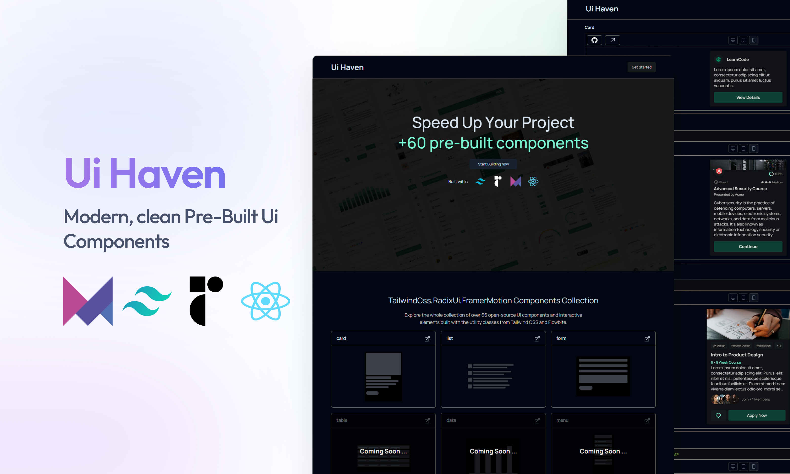

<!-- ReadMe inspiration From JavaScriptMastery -->

<div align="center">
  <br />
    <a href="https://youtu.be/R8CIO1DZ2b8" target="_blank" style="border:1px solid red;border-radius:20px;">
      
    </a>
  
  <br />

  <div>
    


    


   
  </div>

  <h3 align="center">Ui Haven</h3>

   <div align="center">
     Pre-Built Ui Components
    </div>
</div>

## 📋 <a name="table">Table of Contents</a>

1. 🤖 [Introduction](#introduction)
2. ⚙️ [Tech Stack](#tech-stack)
3. 🔋 [Features](#features)
4. 🤸 [Quick Start](#quick-start)
5. 🕸️ [Assets & Code](#snippets)
6. 🚀 [More](#more)

## <a name="introduction">🤖 Introduction</a>
A collection of pre-built Ui elements that help you speed up your development process

## <a name="tech-stack">⚙️ Tech Stack</a>

- Next.js
- TypeScript
- Radix Ui
- Framer Motion
- shadcn
- Tailwind CSS

## <a name="quick-start">🤸 Quick Start</a>

Follow these steps to set up the project locally on your machine.

**Prerequisites**

Make sure you have the following installed on your machine:

- [Git](https://git-scm.com/)
- [Node.js](https://nodejs.org/en)
- [npm](https://www.npmjs.com/) (Node Package Manager)

**Cloning the Repository**

```bash
git clone https://github.com/islamBelabbes/ui-haven.git
cd ui-haven
```

**Installation**

Install the project dependencies using npm:

```bash
npm install
```
**Running the Project**

```bash
npm run dev
```

Open [http://localhost:3000](http://localhost:3000) in your browser to view the project.

## <a name="links">🔗 Links</a>

You Can Find the Figma File of the Ui Elements [here](https://www.figma.com/community/file/1124982314884360813/user-interface-elements) -> (copyright to Tré Wilson)
